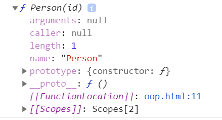

# 前端

## 前端模块化之 CommonJS 与 ES6 模块化

### 为什么要使用前端模块化

- 减少代码污染.
- 数据更安全,防止外部修改.
- 提高可维护性.

### 什么是前端模块化

将大工程代码拆分,分成多个模块,按需引入使用.

以下浅谈常用的 CommonJS 与 ES6 模块化

### ES6 模块化

**首先 nodejs 以及浏览器默认是不支持 es6 模块化的**

先来看下在浏览器环境下 es6 模块化的一个案例:

创建三个文件,index.html 页面,index.js 页面对应的 js 文件,module.js 是页面 js 对应的模块化 js 文件

**module.js**

```js
let name = "hello";
let age = 18;
let obj = {
  key: 111,
  value: 222,
};

export { obj, name, age };
```

**index.js**

```js
import { obj, name, age } from "./module.js";
console.log(obj, name, age);
```

**创建一个 index.html 引入 index.js**

```html
<script type="module" src="./index.js"></script>
```

在此有两个需要注意的点:

1. 不能直接在 index.html 右键浏览器打开,会报以下错误
   解决方案:这里可以使用 vscode 中的 Live 插件,使用服务器的访问 index.html

   

2. 浏览器默认不支持模块化
   解决方案:在引入的 script 标签声明 type="module"

   

这些问题解决后,就能看到引入数据成功啦~


### ES6 模块化的几种导出方式:

1. 每个模块化文件仅可以写一个 default 导出

```js
// 导出
export default {
  name: "hello",
  age: 18,
};

//导入
import obj from "./module.js";
```

2. default 和变量一起导出

```js
// 导出
export default {
  name: "hello",
  age: 18,
};

export let a = "aaa";

//导入
import obj, { a } from "./module.js";
```

3. 抽离代码封装成函数,使其变成 export 成员导出

```js
// 导出
let fn1 = function () {};
let fn2 = function () {};

export { fn1, fn2 };

//导入
import { fn1, fn2 } from "./module.js";
```

这里就大概把 es6 模块化介绍完毕,由于 node 环境不支持 es6 模块化语法,所以就要使用到 node 环境所支持的 CommonJS 模块化规范

### CommonJS

CommonJS 是一种被广泛使用的 js 模块化规范，核心思想是通过 require 方法来同步加载依赖的其他模块，通过 module.exports 导出需要暴露的接口。

```js
// 导出
exports.add = function (num) {
  return num + 2;
};

//导入
var math = require("./module");
math.add(1);
```

### babel

nodejs 不支持 es6 模块化规范,但可以使用第三方工具解决

1. 在任意目录下执行，全局安装 `babel-cli` 和 `browserify`： npm install babel-cli browserify -g

2. 在自己项目目录下执行：npm install babel-preset-es2015 --save-dev

3. 在项目根目录新建 .babelrc 文件 :

4. 在 src 目录下书写完代码后，执行:babel src -d lib

```
{
  "presets":["es2015"]
}
```

## JavaScript 面向对象

**找对象了嘛, 没有的话我们看怎么自己 new 一个吧~**

### 原型

**下面的解说基于如下示例代码**

```js
// Person构造函数
function Person(id) {
  this.id = id;
}
// 使用Person构造函数创建的实例对象obj
let obj = new Person(1);
```

- 首先我们要知道, js 中构造函数和普通函数语法是一样的, 只是我们对于构造函数一般会使用首字母大写的方式来定义函数名称, 以便区分于一般函数,而已......
- js 中每个函数会有一个`prototype`属性, 指向原型:
  _打印 Person_

```js
console.dir(Person);
```



- 原型上也有一个`constructor`属性, 指向构造函数
  _打印 Person 的原型_

```js
console.dir(Person.prototype);
```


以上可以得出结论:

```js
// true
console.log(Person.prototype.constructor === Person);
```

- 用函数创建出来的实例对象,有个`proto`属性(在多数浏览器中我们调试看到的是`__proto__`), 又指向了该函数的原型
  
  所以, `obj`的`__proto__`指向了`Person`的原型对象

```js
// true
console.log(obj.__proto__ === Person.prototype);
```

> 这么一看, `实例`, `prototype`, `__proto__`的关系是不是就出来了?


### 原型链

以上说了`实例`, `prototype`, `__proto__`的关系, 下面来说下原型链;
还是以刚开始的代码为例:

- 我们知道一个实例对象的`__proto__`会指向该实例对象的原型
- 而 js 中所有函数的父类都是`Object`, 所有函数都是`Object`的实例,所以可以得出结论**所有函数的原型中的`__proto__`是指向`Object`原型的**

```js
// true
console.log(Person.prototype.__proto__ === Object.prototype);
```

- 现在给 Person 生成一个子类`Lucy`

```js
class Lucy extends Person {
  // 这里可以写Lucy特性相关的属性或函数...
}
let lucy = new Lucy(2);
console.dir(lucy);
```


由此图可以得出结论:

```js
// true
console.log(lucy.__proto__ === Lucy.prototype);
// true
console.log(lucy.__proto__.__proto__ === Person.prototype);
// true
console.log(lucy.__proto__.__proto__.__proto__ === Object.prototype);
```

> 这么一看, 是不是原型链的关系就出来了?


### 基于 prototype 的继承

我们知道声明一个"类"可以使用这种方式:

```js
// 构造函数, 函数名称首字母大写
function Book(id, name) {
  this.id = id;
  this.name = name;
  this.title = "我是父类的成员";
}
```

然后在父类`Book`的原型上写个属性和方法, 方便待会儿验证子类的继承:

```js
// 原型上的属性
Book.prototype.type = "文学";
// 原型上的toStr方法,打印当前实例的成员
Book.prototype.toStr = function () {
  return `${JSON.stringify(this)}`;
};
// 创建父类book实例
let book = new Book(1, "es6从入门到精通");

// 打印结果:{"id":1,"name":"es6从入门到精通","title":"我是父类的成员"}
console.log(book.toStr());
```

那么如果有一个类要继承`Book`的属性或方法呢?
这时候我们一般会使用原型去实现继承:

```js
// 子类构造函数
function Page(id, name) {
  // 继承父类成员
  Book.apply(this, arguments);
  // 子类自身的属性
  this.pageSize = 10;
}
// 让子类的原型指向父类的实例,那么子类原型就可以访问父类原型上的成员
Page.prototype = new Book();
let page = new Page(2, "java从入门到精通");

// 打印结果{"id":2,"name":"java从入门到精通","title":"我是父类的成员","pageSize":10}
console.log(page.toStr());
```

从以上可以看出, `page`成功继承了父类的`title`属性和`toStr`方法.

### es6 面向对象

虽然以上实现了我想要的效果, 但说实话看着有点绕, 可读性比较差, 这时候就可以使用到 es6 提供的关于面向对象的语法糖了.

```js
class Book {
  constructor(id, name) {
    this.id = id;
    this.name = name;
    this.title = "我是父类的成员";
  }
  toStr() {
    return `${JSON.stringify(this)}`;
  }
}

class Page extends Book {
  pageSize = 10;
}

let book = new Book(1, "es6从入门到精通");

// 打印结果: {"id":1,"name":"es6从入门到精通","title":"我是父类的成员"}
console.log(book.toStr());

let page = new Page(2, "java从入门到精通");

// 打印结果: {"id":2,"name":"java从入门到精通","title":"我是父类的成员","pageSize":10}
console.log(page.toStr());
```

真的是~~~


另外想要提一下`extends`关键字:

```js
class Son extends Father {}

//等同于
class Son extends Parent {
  constructor(...args) {
    super(...args);
  }
}
```

这样一来, 看着友好简洁多了,可以说和一般后端的面向对象写法都大同小异了...
