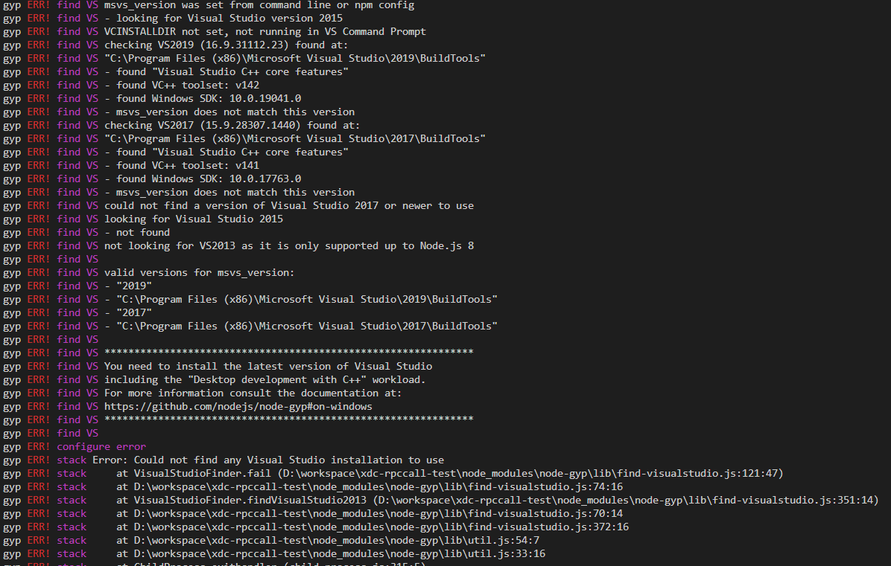

# 那些年踩的坑——工具类

## Error: Could not find any Visual Studio installation to use

### 情景再现



### 解决方案

方案 1: 根据报错提示安装最新版本的 visual studio, 并引入相关的 c++桌面开发工具;

```
gyp ERR! find VS You need to install the latest version of Visual Studio
gyp ERR! find VS including the "Desktop development with C++" workload.
gyp ERR! find VS For more information consult the documentation at:
gyp ERR! find VS https://github.com/nodejs/node-gyp#on-windows
```

报错友好, 提供了指引地址: https://github.com/nodejs/node-gyp#on-windows

### 具体操作


方案 2: 可以试下全局安装构建工具

```
npm install --global windows-build-tools
```

### Tips

相关依赖是否需要 python 环境? 需要可安装 2.7.x 版本

## nodemon热更新显示端口占用
### 解决方式

在项目根目录处添加`nodemon.json`配置文件:  

每次程序重启或者崩溃的时候先kill掉3000端口再跑程序

```js
{
    "events": {
      "restart": "kill -9 $(lsof -t -i:3000)", //子进程重启
      "crash": "kill -9 $(lsof -t -i:3000)"   //子进程崩溃
    },
   "delay": "3200"
}
```

## vscode 远程同步插件SFTP使用指引

### vscode 向远程云开发机同步代码

#### 使用插件 SFTP

vscode 提供远程同步插件

##### 使用步骤

1. 在vscode中下载SFTP插件

2. 在vscode中使用快捷键`Ctrl+Shift+P` ,会在所在的项目根目录中生成.vscode文件夹，对应下面会生成一个sftp.json配置文件

3. sftp配置文件常用参数说明：

   ```json
   {
       "name": 该远程同步配置名称（自定义）,
       "protocol": "sftp",
       "host": 远程IP,
       "port": 远程端口号，
       "username": 远程机器的登录账号,
       "password": 远程机器的登录密码,
       "remotePath": 远程同步路径,
       "uploadOnSave": 保存时自动上传,
       // 要忽略的文件夹/文件
       "ignore": [
           "**/.vscode/**",
           "**/.idea/**",
           "**/.git/**",
           "**/.DS_Store",
           "**/node_modules/**"
       ],
       // 监听器
       "watcher": {
           "files": 需要监听变化的文件夹,
           "autoUpload": 自动上传,
           "autoDelete": 自动删除
       }
   }
   ```

4. 以上配置完成，更新或者删除文件就会同步到远程机器上了


##### sftp.json配置示例

```json
{
    "name": "DevCloud",
    "protocol": "sftp",
    "host": "ip地址",
    "port": 36000,
    "username": "admin",
    "password": "admin123",
    "remotePath": "/home/admin",
    "uploadOnSave": true,
    "ignore": [
        "**/.vscode/**",
        "**/.idea/**",
        "**/.git/**",
        "**/.DS_Store",
        "**/node_modules/**"
    ],
    "watcher": {
        "files": "mmpayxdccoretradecolddataboss/*",
        "autoUpload": true,
        "autoDelete": true
    }
}
```


#### 踩坑

报错信息：[error] Error: Config Not Found. (file:///d:/workspace/.vscode/XXXXX) 

注意sftp.json文件的context属性配置！！！

context ：本地要同步的目录，可不配置该属性，默认是.vscode文件夹根目录下的项目，如需配置，应写当前项目的上一级目录，当配置多个项目远程同步时，需保证context属性唯一。如需配置，示例如下：

```json
    "context": "D:\\workspace"
```

