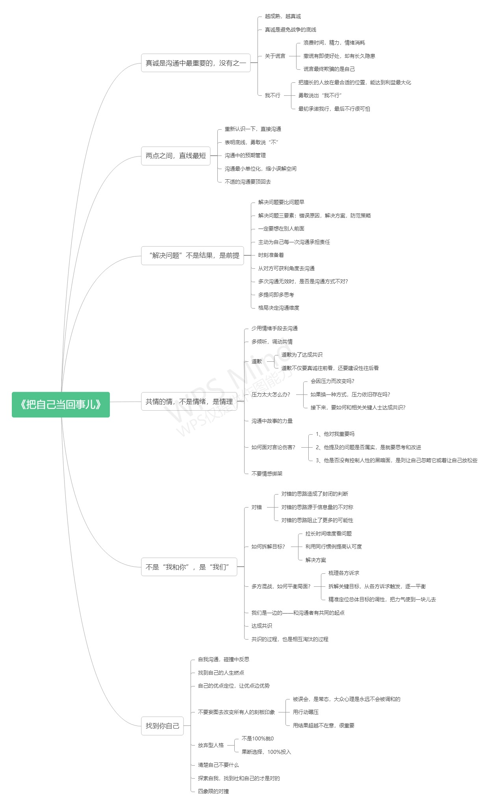

# 课外书
## 《把自己当回事儿》杨天真
[[toc]]
### 简介
* 杨天真
1985年1月25日出生  ，毕业于中国传媒大学导演专业  ，北京大学EMBA学位 。壹心娱乐CEO、Plusmall（大码女装品牌）创始人。

* 《把自己当回事儿》是杨天真的沟通秘籍。她什么都懂，却还那么天真！

# 概要
温馨提醒: 请鼠标右键"在新标签页中打开图片" 再点击放大镜看原图哦~

### 摘抄
>别人的不真诚、总体环境的不真诚、都不能成为我们自己不真诚的理由。

> 比喻：我们社会上每个人都在同一水平面上看前面戏台的戏，本来大家都好好站着，谁都挡不到彼此。突然，有一个人为了能够看得更清楚，就在没有和大家商量的情况下踮起了脚。大家劝他，他不听，于是他后面的人也只能无奈地踮起脚。 ——当普遍的信任度降得很低时，真诚就成了一种很奢侈的事。

>假话全不说，真话不全说。

>彻底清创，对症下药。

>人们情愿相信穿着真实衣服的谎言，也不愿面对赤裸的现实。

>我们只需要出现在最合适自己的位置上，完成各自擅长的部分，自然就会实现资源和效果的优化配置。

>尴尬只是体验层面的不平衡。

>人们为什么情愿受后来生活的苦，也不愿意承担年少时学习的苦呢?
答：因为学习的苦你要主动迎上去吃，但是后来生活的苦，就算你躺着，它自己也会来。

>没有人可以轻易做到临场发挥，所有临场发挥都是厚积薄发。

>沟通的氛围应该是轻松的，但沟通者的思考状态不能松弛。只有在沟通前和沟通中时刻聚焦最核心的目标，时刻寻找共识的基础，时刻切入共情的场景，我们才能让沟通真正地有效。

>聪明人之所以能够存在于这个世界，就是因为这个世界永远都会有笨蛋。

>我们作为有情感的人类，都对故事有着天然的亲近感和好奇。一个好的故事，总能拨动我们内心深处最感性也最脆弱的部分，让我们在情感上无法抗拒。

>一个和尚挑水喝，两个和尚抬水喝，三个和尚没水喝。——寓意：办一件事，如果没制度作保证，责任不落实，人多反而办不成事。说明集体职责分工不明确，竞争机制不健全，奖惩机制不见效，成员之间不团结，团队精神无合力。

>这是一个用拼命奔跑定义成功的时代，却有那么多人捧着别人给出的标准答案，喝着鸡汤，打着鸡血过自己的人生。

### 普鲁斯特问卷
#### 建议：
可每隔3年或5年重新做一次，
看自己那些方面是否有所变化。

1.你认为完美的幸福是什么？

2.你最恐惧的是什么？

3.你最认同哪位历史人物？

4.在世的人当中，你最欣赏谁？

5.你最痛恨自己哪一点？

6.你最讨厌别人哪一点？

7.你最奢侈的是什么？

8.你最喜爱的旅程是什么？

9.你认为最被高估的美德是什么？

10.你在什么情况下会撒谎？

11.你对自己外表的哪一点最不满意？

12.你最瞧不起在世的什么人？

13.你使用最频繁的单词或短语是什么？

14.你最大的遗憾是什么？

15.你生命中的至爱是什么人或物？

16.你最期望拥有什么才能？

17.你现在的心境如何？

18.如果你能改变你家庭的某一点，你期望是什么？

19.你认为自己最大的成就是什么？

20.如果死后有来生，你觉得你会变成什么人或东西？

21.如果你有这个选择权呢？你想成为什么？

22.你最宝贵的财产是什么？

23.你认为程度最轻的痛苦是什么？

24.你希望住在哪里？

25.你最喜爱的职业是什么？

26.你最出众的特质是什么？

27.你最欣赏男人的哪种品质？

28.你最欣赏女人的哪种品质？

29.你最重视朋友身上的哪点品质？

30.你最喜爱的作家是谁？

31.你最喜爱的小说英雄人物是谁？

32.现实生活中你最喜爱哪些英雄人物？

33.你最喜欢的名字是什么？

34.你最讨厌什么？

35.你希望以何种方式死去？

36.你的座右铭是什么？