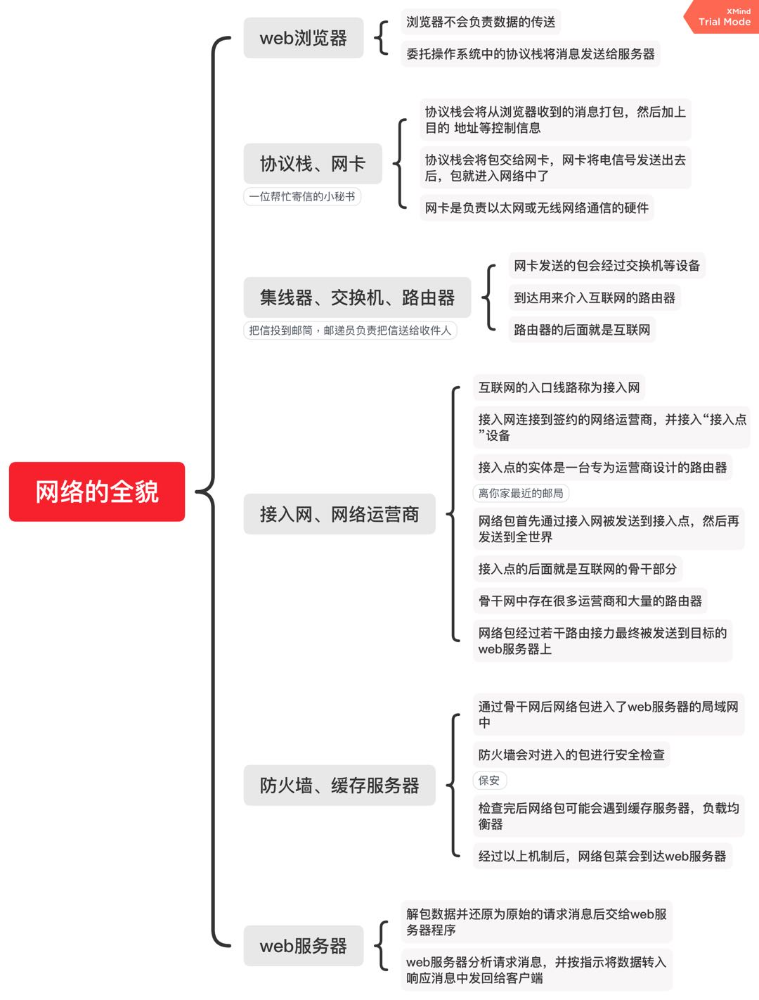
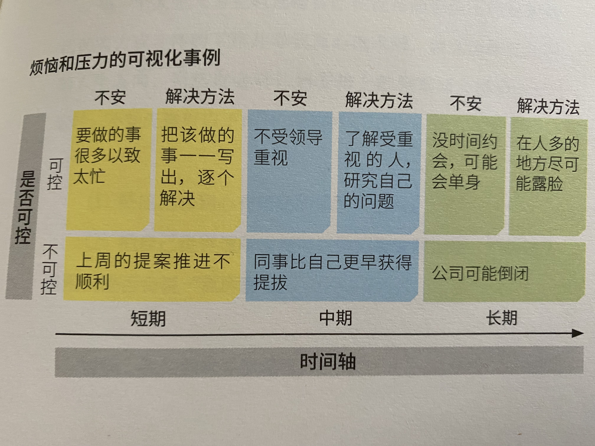

# 实用/工具类
[[toc]]
## 《网络是怎样连接的》[日]户根勤
# 前言
本书讲解了网络的全貌以及重点介绍了实际的网络设备和软件是如何工作的。

### 网络的全貌
浏览器向web服务器发送请求，
web服务器根据请求向浏览器发送响应。
由于请求和响应在传递的过程中可能丢失或损坏，所以我们需要一种机制将数字信息搬运到指定目的地。
负责搬运数字的机制加上浏览器和web服务器这些网络应用程序， 这两部分就组成了网络。

* 思维导图

## 《起床后的黄金1小时》[日]池田千惠

池田千惠坚持早起26年、是风靡日本的“早起计划”发起人。而日本作家村上春树，也早睡早起坚持了35年，优秀的人总是有优良的习惯，而这里藏着他的运气。一个好的习惯可以改善自己的拖延症，提高自控力和执行力。

 #### 前言
本书不是告诉我们怎么才算早起，而是告诉我们如何利用好早上的黄金一小时，让我们能把力气都使用在刀刃上。如果我们常感到时间不够用或者对职业发展感到迷茫，我们不妨从书中看能不能找到可借鉴的方案执行。

早上的黄金一小时计划会遵循以下原则：
**前30分钟做好一天的工作分类（工作计划），后30分钟朝着理想的努力践行。**

### 章节概要

#### 起床大作战
>时间就像存钱，觉得有多余的就存起来。
我们日常工作中是否会有“工作混沌”状态？
* 工作拖沓
* 任务多的时候感觉都没有完成好
* 找不到合适自己的道路

如果有以上问题，我们需要利用好工作前的一小时，那就是今天的早起后黄金一小时，不必得五点，六点才算，如果我们可以10点开始工作，那么我们就利用好九点到十点这段时间去安排今天一天的工作计划，确定优先级。

#### 坚持早起的好处
1.逐渐改变平常生活的习惯比较容易。
2.行动前的障碍比较少。
3.大脑没有拥塞，所以做事效率高。
4.结束时间是固定的，所以不会拖拖拉拉。
5.获取小小的成就，生活会比较自如。
6.此时不受打扰，容易集中注意力。

#### 学会播种
播种：对自身发展有利的事情，不紧急但很重要，需要长期学习积累。如职业升级，自我学习磨砺等。

* 播种的东西需要我们具体化，才能全身心投入。
* 播种要尽快做，计划很重要。

这里我认为播种也可以发展自身的兴趣爱好，当我们把播种方向定为兴趣爱好的时候，“收获”的时候就是成功的把擅长的事变为自身的优势了。

#### 给自己定位，了解个人志向
分类：
* 工作&工作志向
* 工作&个人志向
* 工作&第二职业志向
* 工作&投资志向
从定位上看，工作是占了主要地位，志向会随着自己不同阶段而变化，从现在了解自己的志向，想清楚这个问题：

>现在必须努力做什么？或者 可以放弃什么？

#### 四象限法则
* 不紧急&重要 = 红色
* 紧急&重要 = 绿色
* 紧急&不重要 = 蓝色
* 不紧急&不重要 = 黑色
我们可以将计划放在是否紧急，是否重要的四象限里面做定位，这样就可以清楚看到任务是属于什么颜色，优先级就出来了。

#### 早点起床 能够活出更美好的生活
##### 制定工作计划的七个好处：
1.形成决策习惯，行动高效。
2.可以排除瞻前顾后、畏惧不前的心理。
3.可以预见自己的工作效果。
4.不会一直为工作纠缠。
5.可以完善自己工作的常见问题集。
6.分清有效加班和无效加班。
7.可以每天集中精力。

#### 早起先断网，养成好习惯

>信息的丰富，导致我们注意力的贫困

>自己的认知到底是头脑思考的结果，还是受网上舆论的带动，一系列的判断标准都会变得模糊。

所以我们“早上1小时”期间，最好是做到断网。

#### 写出工作内容
这样做有两点好处
1.工作内容这部分记忆交给笔和纸承担，节约大脑空间。
2.防止遗忘。

### 利用早起，提高工作效率
#### 方法
* 上面在四象限中讲到四种颜色给工作计划分出了优先级。
并提到写工作计划很重要。那么将这两点结合起来，将我们每条工作计划都用其对应的颜色标记好。
* 然后我们需要将每条工作计划分解开，具体化。目的是防止遗忘细节，在早上集中注意力的时候一般我们会将细节考虑得更全面周到，在完成好工作后就可以看着计划复盘，看是否有遗漏。
* 刚开始做了工作完美的工作计划去推行，那么在完成不了的时候就有失信息，我们完成计划的百分之80就好。后续不断反思、调整、弥补直至完成，这是维持工作动力的关键。

#### 用思维导图对工作进行宏观把握

>“早上一小时”的工作计划如果仅仅专注于细微之处，就会忽视客观状况的变化，认为只要做好当前的工作就好，从而将手段视为工作的目的。为了防止这一问题，每3-6个月就要灵活使用思维导图或工作进展图，做到有的放矢。

#### 早起不会背叛你，扫除精进路上的障碍
##### 没有干劲
把工作细化！例如有项计划是“收拾客厅”，那么我们做的细化任务就可以是：
1.任掉不需要的东西
2.把凌乱的物品放到原来的位置
3.使用清扫机
4.借助擦拭器

##### 总是拖延
将烦恼和压力进行可视化分类：
1.讲烦恼不安的原因随机写出
2.做个坐标轴，横坐标表示时间，纵坐标表示是否能解决，对每个烦恼进行分配
3.先不用担心那些暂时解决不了的（无法控制）烦恼，要对那些发挥主观能动性就可以解决（可以控制）的烦恼倾注心力，然后思考解决方法

>这么做的好处，是可以站在客观的角度，审视那些动脑也无法想出解决办法的问题。

>可以先思考短期内容易解决的问题，头脑会慢慢变得清晰。按照这种节奏，然后再制订中期，长期计划，努力解决其余问题。

##### 感到迷茫
1. 把自己感到心有郁结的事情写出来

>自我感觉的困难中，往往隐藏着巨大的能量和价值。
2. 确认周围人是否会说“真厉害”
可以讲自己认为理所当然的事告诉给周围人，再看他们的反应和反应的程度强烈。

>与周围人所说的“厉害”次数相比较来探究自己的强大之处。

##### 如何实现梦想
上面提到过志向和播种的问题，我们需要找到最有助于未来发展的选项才算真正的“播种”。

* 我们可以通过“5W2H”为切入点来进行验证
when，where，who，what，why，how

* 释放自己心声也需要勇气
做好规划，将自己的梦想具体话，即使失败了，也不用怕丢人，按照5W2H的思考再重整旗鼓，每天坚持“早上1小时”无论何时都可以开始。

### 早起，遇见全新的自己
#### 读书
坚持读书，可以让原本空白的大脑收到知识的滋养，而且体味到果断做事的甜头。
>晨读重在应用，夜读重在消遣

#### 客观认识工作中的”暂时缺陷“
我们工作过程中很少能一气呵成并完成得十全十美，就像我做开发工作，我没办法一开始能考虑好最佳的交互方式和代码逻辑实现，那我们可以在做好自己能做的部分后，进行若干次的检查思考，弥补缺陷，逐渐提高工作能力。

#### 工作，人生，播种

>我么要充分借助所在的企业的平台和环境，努力实现自己想做的事。如果是这样的想法，那么每天的干劲都会是充足的。

### 做”神奇“的事，成为出众的人
#### 将兴趣融入工作

>当你把经验讲出，就好比是把教课书上的知识分享给大家听。因为这是以你经验为基础，所以相关观点都是来自你独特的东西。

#### 试销自己
试着按照幼儿园，小学，初中，高中等各个阶段来区分，写出”三大高兴事“和”三大悲伤事“

>看看自己有哪些废寝忘食的游玩体验和一直耿耿于怀的忧愤之情。

>试销自己：假设自己发展的方向性，然后做个小小的尝试，进而再行调整，这样就会重点关照到自己的喜好和自我发展中的价值观问题。

#### 尝试”多管闲事“
身边发生的事情随时可以给自己提供灵感。
思考

>你觉得那些做的不好的事为什么觉得做的不好，然后用自己的专业知识来解释。从before到after，如何改变才好。

其实这也是提倡大家多思考，如我日常做前端开发，看到任意一个网页，我认为哪里设计得不好，我可以写出来，怎么不好，怎么可以做到更好，并讲这一段思考过程写到文章中沉淀下来。

#### 将自己的经验加工成商品
1.把自己的所有经验一股脑都想出来，包括个人经验。
2.思考自己的经验是否能帮助遇到困惑的人。
3.把自己的经验传输出去后，听一听周围的反应。

#### 打破规则和框架

>如果过于坚守规则，思考就会限定在固有的框架中而不能自拔。

### 制定你的早起方案
* 早起不是目的而是手段，如何释放干劲成了生活中的大学问，我们不能以缩短睡眠时间而去早起。
* 新习惯的养成，一般需要10天到两周的时间。
* 设置理想的时间
* 可以用手帐做计划，时间不允许的时候我们可以利用通勤时间用app来做自己的工作计划。

### 只要起床，就是一场胜利

>“早上1小时”的本质，就是消除各类纷繁复杂，梳理不知所措的内心，让大家学会科学利用时间。

