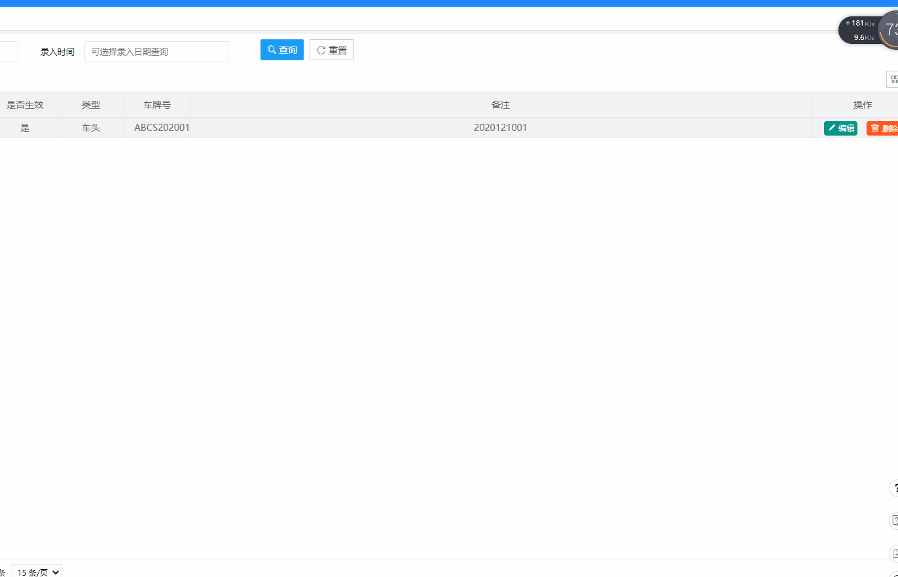
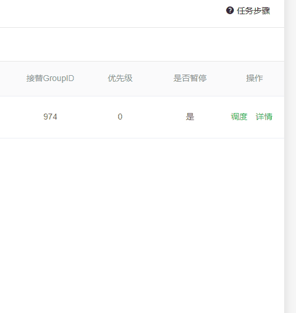
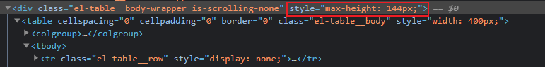
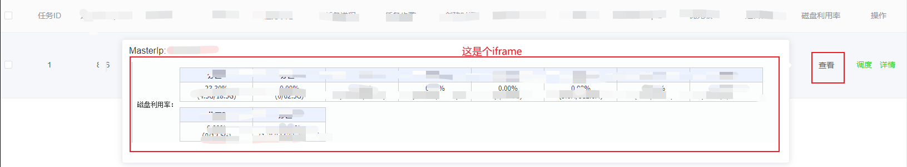
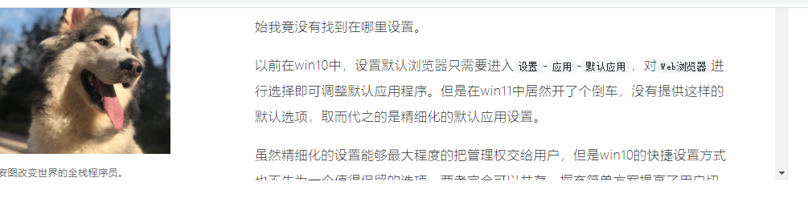
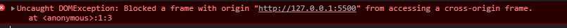
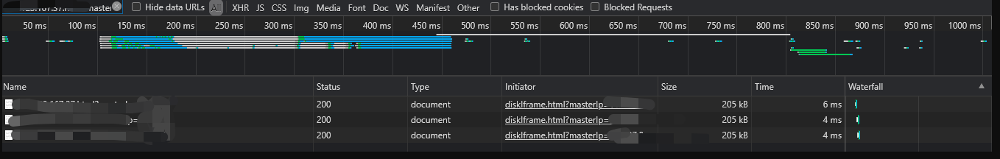

# html/css

## 利用html热区技术监听图片点击事件

#### 需求
通过监听点击**图片**的某个范围绑定事件。


### 如何设置html热区？
利用img结合map和area标签锁定热区
**HTML `<map>` 属性** 与 [`<area>`](https://developer.mozilla.org/zh-CN/docs/Web/HTML/Element/area) 属性一起使用来定义一个图像映射(一个可点击的链接区域).

#### 使用方式
* 在线图片坐标拾取工具
https://tooltt.com/img-coord/


### map
``` html
 
            <map name="front" id="front">
                <area shape="rect" coords="45,36,65,86" id="firstLeft"/>
                <area shape="rect" coords="207,38,227,85" id="firstRight"/>
              <!-- 可以绑定更多热区... -->
            </map>
```
我们需要在`img`设置usemap来与`map`标签确定绑定关系. *如以上使用的是front绑定两者关系*

### area 
`shape` 属性用于定义图像映射中对鼠标敏感的区域的形状：
 圆形（circ 或 circle）
 多边形（poly 或 polygon）
 矩形（rect 或 rectangle）


`coords` 给热点区域设定具体的坐标值。
 这个值的数值和意义取决于这个值所描述的**形状**属性。
 对于矩形或长方形, 这个**coords**值为两个X,Y对：左上、右下。 
 对于圆形, 这个值是 `x,y,r` ，这里的 `x,y` 是一对确定圆的中心的坐标而 `r` 则表示的是半径值.。
 对于多边和多边形，这个值是用x,y对表示的多边形的每一个点：`x1,y1,x2,y2,x3,y3,`等等。

`area`标签还可以绑定`href`来实现热区点击跳转, 但这部分我需求没用到, 可以给热区域绑定`id`, 来结合业务需求实现功能, *如我是用热区域id绑定了点击事件*

更多扩展属性, 可看[这里](https://developer.mozilla.org/zh-CN/docs/Web/HTML/Element/map)

所以结合以上的例子来看, 我使用的热区域形状是矩形, 并且指定了热区矩形左上角的x1,y1和右下角的x2,y2坐标来确定热区范围的

#### 扩展
点击不同热区锁定到不同input焦点
主要是两点
1. 确定热区和input的联系
如我需求中可通过索引确定两者联系, 即左上第一个热区对应的是列表第一行表单.
2. 通过索引绑定焦点
这里关键点是用jquery获得索引对应的input标签对象, 再使用`focus`焦点事件锁定焦点
``` js
    //车头热区点击事件
    $('#front area').click(function(event){
        //area热区id
        let {id} = event.currentTarget;
        let carFrontTireArea = constantsExt.carFrontTireArea[id];
        let {text,num} = carFrontTireArea;
        const focusTd = $('#editTable tbody tr').eq(num-1)[0];
        const custLidInput = $(focusTd).find('td[data-field="custLid"] input')[0];
        custLidInput.focus();
    });
```

当然, 如果想要焦点更直观, 我们可以利用css伪类给获取焦点时的input加点css效果:
``` css
    input:focus
    {
        background-color: yellow;
    }
```

## 搜索过滤和滚动定位

#### 来看效果


### 实现
 html
使用elementUI的Popover 弹出框和input组件
```html
      <el-popover placement="bottom-end" trigger="hover">
        <el-input v-model="positionStep" type="text" placeholder="可输入步骤后按回车快速定位" @change="positionTaskStep" />
        <el-table :data="taskStepTip" max-height="400" ref="stepInfoTable">
          <el-table-column width="400" label="步骤:">
            <template slot-scope="scope">
              {{scope.row.no}}. {{scope.row.text}}
            </template>
          </el-table-column>
        </el-table>
        <div slot="reference" class="task-step-help"><i class="el-icon-question"></i> 任务步骤</div>
      </el-popover>
```
关键:
* @change: 仅在输入框失去焦点或用户按下回车时触发事件
* 设置一个**ref**方便获取dom元素

### 滚动定位
* 滚动定位我们可以使用**scrollTop**
Element.scrollTop 属性可以获取或设置一个元素的内容垂直滚动的像素数。
更多属性信息可查看:https://developer.mozilla.org/zh-CN/docs/Web/API/Element/scrollTop
* 滚动到指定行
可以先获取到tr的高度, 然后再根据输入的步骤去计算高度(行号*高度),
最后可通过vue的$el获取dom对象设置scrollTop值
ps: 
* 我这步骤是从1开始, 所以要将输入的行号-1
* 另外要注意在**this.$nextTick**函数内操作dom, 避免获取不到dom元素
```js
        const trHeight = 48; //一行固定的高度
        let inputStep = this.positionStep; //输入的值
        let stepInfoTable = this.$refs.stepInfoTable.$el.querySelector('.el-table__body-wrapper'); //步骤信息列表的dom元素
        stepInfoTable.scrollTop = trHeight * (inputStep - 1); //滚动定位
```
注意:
* 如果获取的scrollTop始终为0(赋值scrollTop不成功), 可以使用以下函数检查滚动所在的盒子获取是否正确
```js
      window.addEventListener(
        'scroll',
        () => {
          var box = _this.$refs.stepInfoTable.$el.querySelector('.el-table__body-wrapper');
          // console.log(scrollTop.scrollHeight)
          console.log(box, box.scrollTop); // 查看打印的值是否有变化 如果有 则说明滚滚动条在这个标签中
          // scrollTop.scrollTop = scrollTop.scrollHeight // 可以尝试下 滚动滚动条。一直在底部则可以设置成功
        },
        true
      );
```

### 字体闪烁
 主要是用了过渡效果+timeout延迟还原
1. 先获取到具体的行
2. 设置要高亮的样式
3. 高亮样式设置过渡时间(transition)
4. 使用timeout还原样式
```js
  let currTr = stepInfoTable.querySelector('tbody').children[inputStep - 1]; //获取定位的tr
        //设置闪烁样式
        currTr.style.color = '#07c160';
        currTr.style.fontSize = '15px';
        currTr.style.transition = '1s';
        setTimeout(() => {
          currTr.style.color = '#606266';
          currTr.style.fontSize = '14px';
        }, 1500);
```

### 搜索过滤
* 对输入内容做匹配过滤, 用display控制过滤结果
```js
  //如果输入的不是纯数字,则对内容进行模糊匹配

       var regExp = new RegExp(`(${inputStep})`, 'i');// 模糊匹配的正则表达式
        if (!/^[0-9]*$/.test(inputStep)) {
          for (let index = 0; index < this.taskStepTip.length; index++) {
            let tr = stepInfoTable.querySelector('tbody').children[index]; //当前遍历的tr
           if (regExp.test(this.taskStepTip[index].text)) {
              tr.style.display = 'table-row';
            } else {
              tr.style.display = 'none';
            }
          }
        } 
```
### 注意
当改变table内容的时候, 这个max-height会动态变化, 重置时要把这个maxHeight根据页面处理一下, 不然内容会显示不全

用@input事件监测输入内容为空时, 恢复所有项的显示
``` js
      //输入内容为空
      if (!this.positionStep) {
        let stepInfoTable = this.$refs.stepInfoTable.$el.querySelector('.el-table__body-wrapper'); //步骤信息列表的dom元素

     stepInfoTable.style.maxHeight = '350px';
        let trList = stepInfoTable.querySelector('tbody').children; //所有tr
        for (let index = 0; index < trList.length; index++) {
          trList[index].style.display = 'table-row';
        }
      }
```

## 关于iframe
话说, 写这篇文章的起源于一个需求。
需要在一个表格内悬浮到某一个单元格时候展示一个内嵌页面悬浮框, 
另外, 这个内嵌页面是只展示局部内容(嵌入的页面只展示中间一部分)...

大概长这样子: (求生欲强, 打码比较多, 差不多懂这个意思就行...)



鼠标移动到**查看**位置展示弹框, 弹框内是内嵌的第三方系统页面，

期间关于使用iframe碰到了好些问题, 在此记录一下。

### 关于iframe的HTML标准
贴一下MDN: https://developer.mozilla.org/zh-CN/docs/Web/HTML/Element/iframe
开始认为iframe提供了相关的属性可以实现这个需求需要的效果, 后来发现网上很多说使用`vspace` 和 `hspace`来控制内容间距, 根本没有效果。查看资料发现有说HTML5 中`iframe`对于`vspace` 和 `hspace`属性已经弃用了的, 也有说从来没有在web规范中提供过这两个属性,  不过的确我看到一些官方性质的文档, 都查不到这两个属性, 多是从别人博客看到这种用法, 或许这是非标准属性吧。

### 如何使用iframe展示局部页面内容?
经过网上冲浪发现了**轶哥**的帖实现过这种效果, 这里借鉴了他的idea: https://www.wyr.me/post/641
其中整个实现思路巧妙的地方在于使用了一个单独的html文件介质
1. 创建**iframe.html**
```html
<!DOCTYPE html>
<html lang="en">

<head>
  <meta charset="UTF-8">
  <meta name="viewport" content="width=device-width, initial-scale=1.0">
  <title>轶哥</title>
</head>

<body>
  <iframe src="https://www.wyr.me/" frameborder="0" scrolling="no"
    style="position: absolute;top: -190px;left: -40px;height: 405px; width: 1024px;"></iframe>
</body>

</html>
```



使用绝对定位并设置好偏移量, 
这里偏移量可以根据自身需要展示的内容做调整

2.内嵌iframe.html, 设置好目标需要的宽高
```html
<!DOCTYPE html>
<html lang="en">

<head>
  <meta charset="UTF-8">
  <meta name="viewport" content="width=device-width, initial-scale=1.0">
  <title>轶哥</title>
</head>

<body style="background-color: #888">
  <iframe src="iframe.html" frameborder="0" scrolling="no"
    style="position: absolute;top: 0px;left: 0px;height: 182px; width: 215px;"></iframe>
</body>

</html>
```


### 跨域的iframe获取iframe内的dom元素
* 不知道有没有小伙伴操作过iframe内的dom元素呢, 怎么获取呢?
我们可以通过iframe的element中`contentWindow `属性获取到iframe的**window**对象。
 它的属性像全局Window 一样是可以操作的。
```js
  let iframeBox = document.getElementsByTagName("iframe")[0].contentWindow;
 iframeBox.document.getElementsByTagName("body")[0].style.backgroundColor = "blue";
```
* 但有一点要注意，以上获取dom的方式，必须要在iframe同域的情况下使用


### ElementUI el-table的fixed固定列引发的bug
在技术实现方案有了之后，实际运用到项目中发现每次hover触发，同一个iframe请求会发起多次：


经过定位, 发现是因为表格有两列使用了ElementUI el-table的fixed属性。
来看看elementUI源码对fixed做了什么处理：
1. 找到fixed入口
```js
    fixed(newVal) {
      if (this.columnConfig) {
        this.columnConfig.fixed = newVal;
        this.owner.store.scheduleLayout(true);
      }
    },
```
2.调用了scheduleLayout
```js
    // 更新 DOM
    scheduleLayout(needUpdateColumns) {
      if (needUpdateColumns) {
        this.updateColumns();
      }
      this.table.debouncedUpdateLayout();
    },

```
3. updateColumns更新列
4. debouncedUpdateLayout防抖更新布局

##DOM的变化会导致iframe重新加载
以上排查过程可以发现, 由于dom重排导致了dom树重新计算引发的问题。

#### dom重绘重排

##### 重排（回流）
重排发生的根本原理就是元素的几何属性发生了改变。如：
* 添加或删除可见的DOM元素
* 元素位置改变
* 元素本身的尺寸发生改变
* 内容改变
* 页面渲染器初始化
* 浏览器窗口大小发生改变

**重排在性能上会有更大开销，日常对dom操作应该集中处理，一次性渲染**
从优化角度，我们可以使用`文档片段`批量操作dom
因为文档片段存在于内存中，并不在DOM树中，所以将子元素插入到文档片段时不会引起页面
使用方式：
```js
var element  = document.getElementById('ul'); // html里有个id为ul的ul标签
var fragment = document.createDocumentFragment();//创建文档片段
var browsers = ['Firefox', 'Chrome', 'Opera',
    'Safari', 'Internet Explorer'];
//批量dom节点处理
browsers.forEach(function(browser) {
    var li = document.createElement('li');
    li.textContent = browser;
    fragment.appendChild(li);
});
//最后一次将文档片段添加到目标dom节点里
element.appendChild(fragment);
```

##### 重绘
当一个元素的外观发生改变，但没有改变布局, 重新把元素外观绘制出来的过程，叫做重绘。
比如我们常见的color、border-style、background等