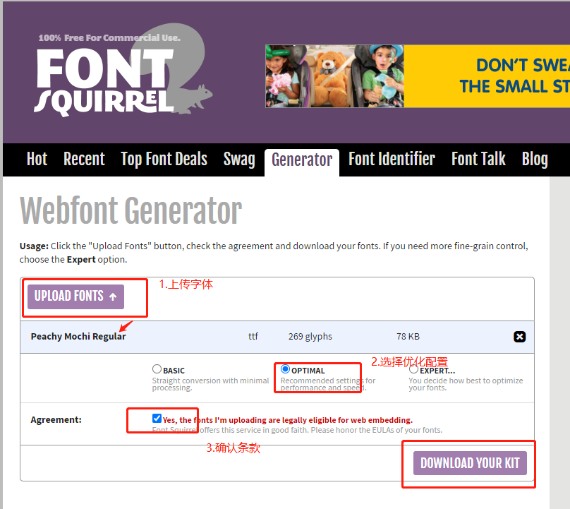

# mark住先

## 素材

**字体**
* [fonts.google](https://fonts.google.com/)
* [dafont](https://www.dafont.com/)

**自定义字体** 
1. 下载字体素材后，使用生成器生成字体文件使用
 [dafont](https://www.fontsquirrel.com/tools/webfont-generator)
 
 ::: warning
如果字体需求包含中文，选择basic，避免优化配置少了中文转换。
:::
2. 定义font-face
```css
@font-face {
  font-family: 'MyFont';
  src: url('./my-font.woff2') format('woff2'),
    url('./my-font.woff') format('woff');
  font-weight: bold;
  font-style: normal;
}
```
3. 使用字体
```css
 .hello {
   color: red;
   font-family: 'MyFont';
 }
```

